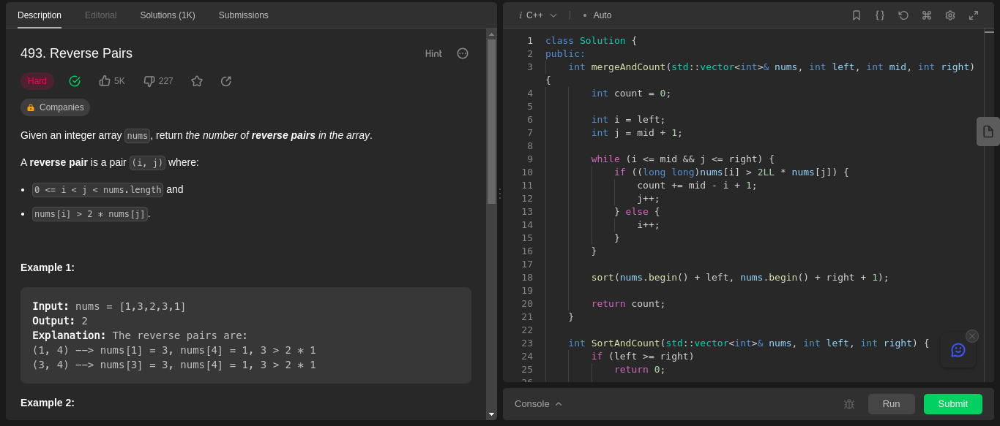

# Exercícios D&C

**Número da Lista**: 22 
**Conteúdo da Disciplina**: Greed 

## Alunos

| Matrícula  | Aluno                      |
| ---------- | -------------------------- |
| 20/0042360 | Nicolas Roberto de Queiroz |

## Sobre

Resolução de exercícios online relacionados aos conteúdos abordados módulo de Dividir e Conquistar.

## Uso

Entre no site disponibilizado em cada exercício e utilize seu respectivo código para submeter, é necessário fazer login para submeter algum código.

## Exercício 1 - Reverse Pairs

Entre no link do [problema](https://leetcode.com/problems/reverse-pairs/) e use o [código](Reverse-Pairs/solve.cpp) disponibilizado.

**Linguagem**: C++ 

### Screenshots

### Vídeo explicando a solução

Produzindo...
